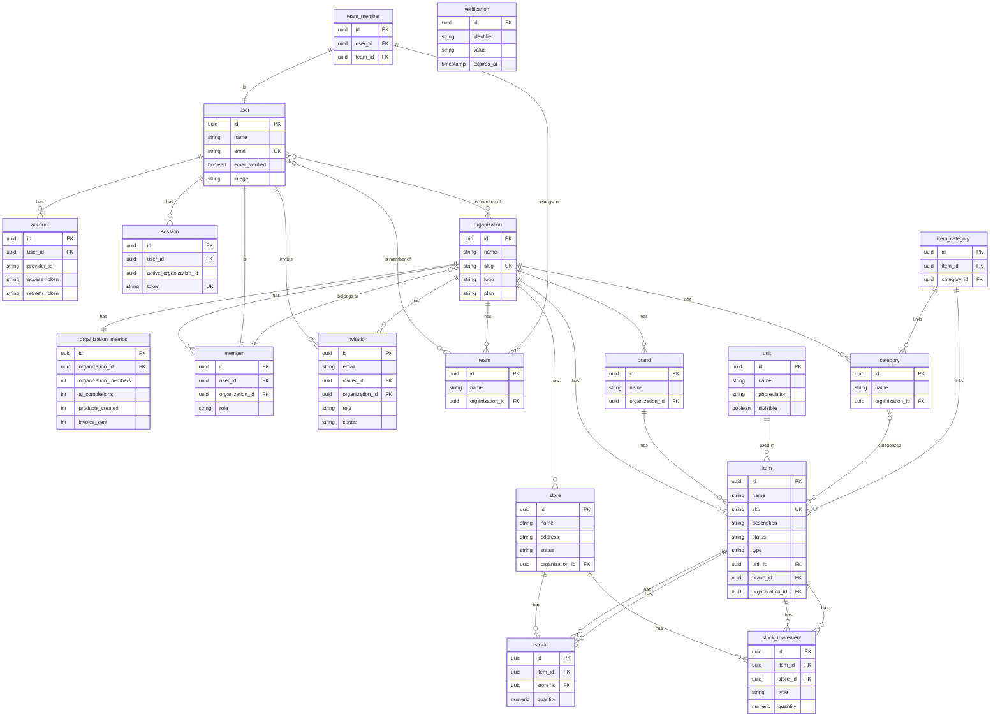

# ERD Documentation

```mermaid
erDiagram
    user {
        uuid id PK
        string name
        string email UK
        boolean email_verified
        string image
    }

    account {
        uuid id PK
        uuid user_id FK
        string provider_id
        string access_token
        string refresh_token
    }

    session {
        uuid id PK
        uuid user_id FK
        uuid active_organization_id
        string token UK
    }

    organization {
        uuid id PK
        string name
        string slug UK
        string logo
        string plan
    }

    organization_metrics {
        uuid id PK
        uuid organization_id FK
        int organization_members
        int ai_completions
        int products_created
        int invoice_sent
    }

    member {
        uuid id PK
        uuid user_id FK
        uuid organization_id FK
        string role
    }

    invitation {
        uuid id PK
        string email
        uuid inviter_id FK
        uuid organization_id FK
        string role
        string status
    }

    team {
        uuid id PK
        string name
        uuid organization_id FK
    }

    team_member {
        uuid id PK
        uuid user_id FK
        uuid team_id FK
    }

    store {
        uuid id PK
        string name
        string address
        string status
        uuid organization_id FK
    }

    item {
        uuid id PK
        string name
        string sku UK
        string description
        string status
        string type
        uuid unit_id FK
        uuid brand_id FK
        uuid organization_id FK
    }

    brand {
        uuid id PK
        string name
        uuid organization_id FK
    }

    category {
        uuid id PK
        string name
        uuid organization_id FK
    }

    item_category {
        uuid id PK
        uuid item_id FK
        uuid category_id FK
    }

    unit {
        uuid id PK
        string name
        string abbreviation
        boolean divisible
    }

    stock {
        uuid id PK
        uuid item_id FK
        uuid store_id FK
        numeric quantity
    }

    stock_movement {
        uuid id PK
        uuid item_id FK
        uuid store_id FK
        string type
        numeric quantity
    }

    verification {
        uuid id PK
        string identifier
        string value
        timestamp expires_at
    }

    user ||--o{ account : "has"
    user ||--o{ session : "has"
    user ||--o{ invitation : "invites"
    user }o--o{ organization : "is member of"
    user }o--o{ team : "is member of"

    organization ||--o{ member : "has"
    organization ||--|| organization_metrics : "has"
    organization ||--o{ brand : "has"
    organization ||--o{ category : "has"
    organization ||--o{ item : "has"
    organization ||--o{ store : "has"
    organization ||--o{ team : "has"
    organization ||--o{ invitation : "has"

    member ||--|| user : "is"
    member ||--o{ organization : "belongs to"

    team_member ||--|| user : "is"
    team_member ||--o{ team : "belongs to"

    brand ||--o{ item : "has"
    unit ||--o{ item : "used in"
    category }o--o{ item : "categorizes"
    item_category ||--o{ item : "links"
    item_category ||--o{ category : "links"

    store ||--o{ stock : "has"
    store ||--o{ stock_movement : "has"

    item ||--o{ stock : "has"
    item ||--o{ stock_movement: "has"

    item ||--o{ stock : "has"
    item ||--o{ stock_movement : "has"
```
